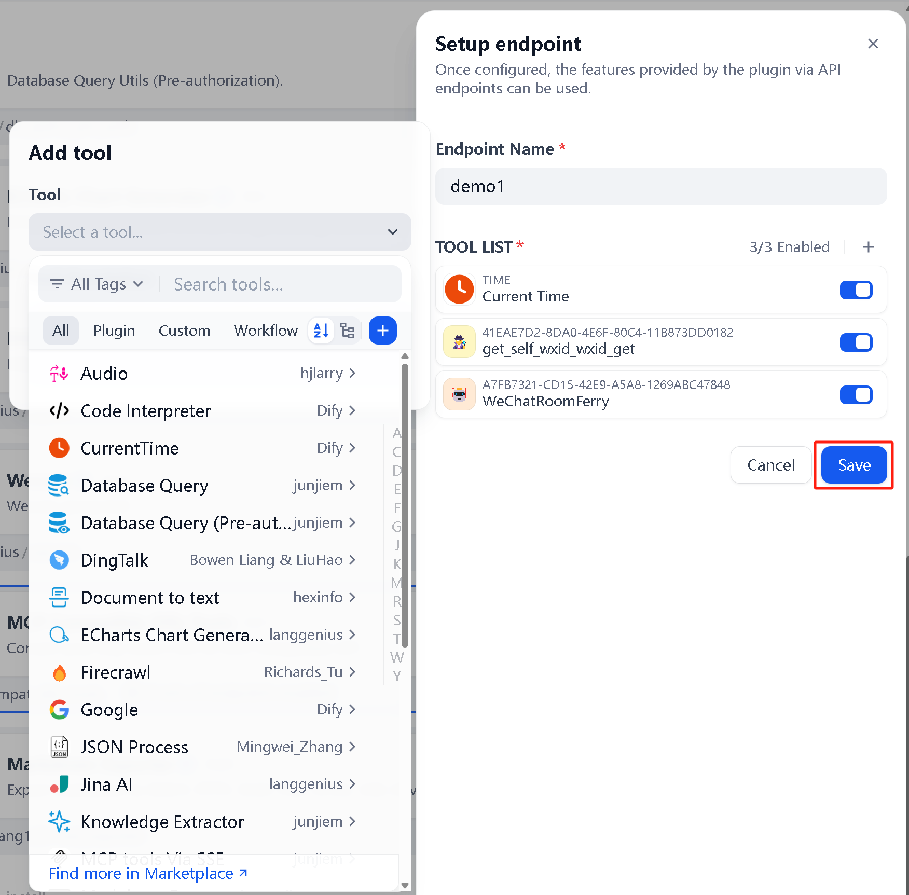
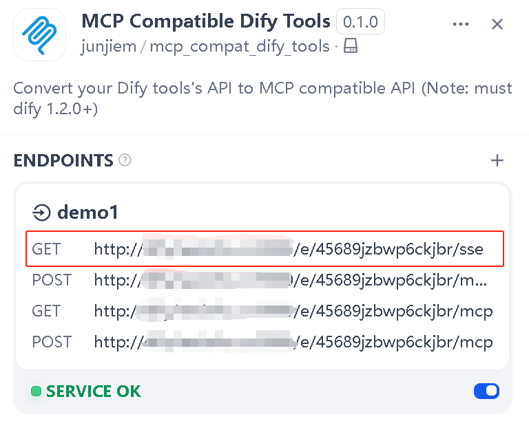
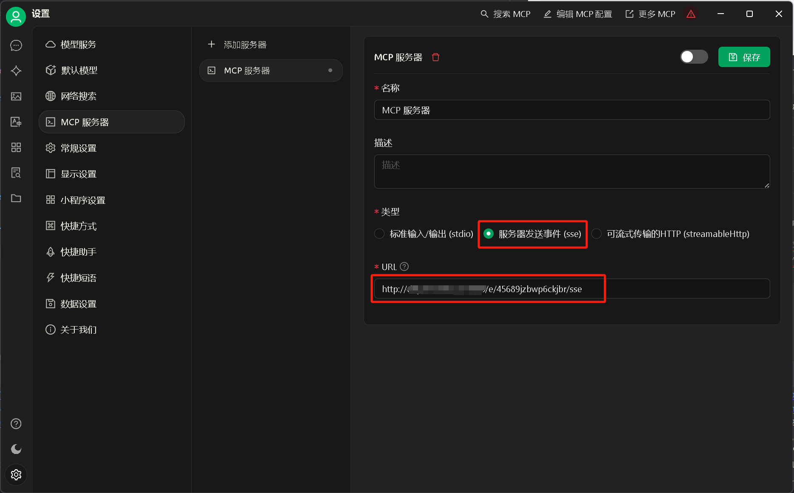

## Dify 1.0 Plugin Convert your Dify tools's API to MCP compatible API

**Author:** [Junjie.M](https://github.com/junjiem)   
**Type:** extension   
**Github Repo:** [https://github.com/junjiem/dify-plugin-mcp_compat_dify_tools](https://github.com/junjiem/dify-plugin-mcp_compat_dify_tools)   
**Github Issues:** [issues](https://github.com/junjiem/dify-plugin-mcp_compat_dify_tools/issues)  

Reference to https://github.com/hjlarry/dify-plugin-mcp_server

---

### Description

> **Note:** must be dify 1.2.0 and above.

> **注:** 必须是 dify 1.2.0及以上版本。

Convert your Dify tools's API to MCP compatible API (**Currently, two transports are supported: `HTTP with SSE` and `Streamable HTTP`**)

将您的 Dify 工具的 API 转换为 MCP 兼容 API (**目前已支持 `HTTP with SSE` 和 `Streamable HTTP` 两种传输方式**)

#### 1. Add a endpoint and add tool list. 添加API端点并添加工具列表。

> **Note:** The modification of the tool list for existing endpoint will take effect only after the endpoint are disabled and then enabled.

> **注：** 对已有 API 端点进行工具列表的修改需要停用再启用 API 端点后才会生效。

#### 2. Copy the endpoint url to your MCP client, like `Cherry Studio`  复制端点url到您的MCP客户端，如 `Cherry Studio`

##### **Option 1:** Use the newest `Streamable HTTP` transport (**Recommended**)  使用最新的`Streamable HTTP`传输方式（**推荐**）

**OK!**

##### **Option 2:** Use the legacy `HTTP with SSE` transport  使用过时的`HTTP with SSE`传输方式

**OK!**

---

### Installing Plugins via GitHub  通过 GitHub 安装插件

Can install the plugin using the GitHub repository address. Visit the Dify platform's plugin management page, choose to install via GitHub, enter the repository address, select version number and package file to complete installation.

可以通过 GitHub 仓库地址安装该插件。访问 Dify 平台的插件管理页，选择通过 GitHub 安装插件，输入仓库地址后，选择版本号和包文件完成安装。

---

### FAQ

#### 1. How to Handle Errors When Installing Plugins? 安装插件时遇到异常应如何处理？

**Issue**: If you encounter the error message: plugin verification has been enabled, and the plugin you want to install has a bad signature, how to handle the issue?

**Solution**: Add the following line to the end of your .env configuration file: FORCE_VERIFYING_SIGNATURE=false
Once this field is added, the Dify platform will allow the installation of all plugins that are not listed (and thus not verified) in the Dify Marketplace.

**问题描述**：安装插件时遇到异常信息：plugin verification has been enabled, and the plugin you want to install has a bad signature，应该如何处理？

**解决办法**：在 .env 配置文件的末尾添加 FORCE_VERIFYING_SIGNATURE=false 字段即可解决该问题。
添加该字段后，Dify 平台将允许安装所有未在 Dify Marketplace 上架（审核）的插件，可能存在安全隐患。

#### 2. How to install the offline version 如何安装离线版本

Scripting tool for downloading Dify plugin package from Dify Marketplace and Github and repackaging [true] offline package (contains dependencies, no need to be connected to the Internet).

从Dify市场和Github下载Dify插件包并重新打【真】离线包（包含依赖，不需要再联网）的脚本工具。

Github Repo: https://github.com/junjiem/dify-plugin-repackaging

